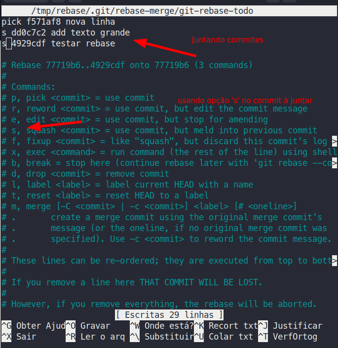
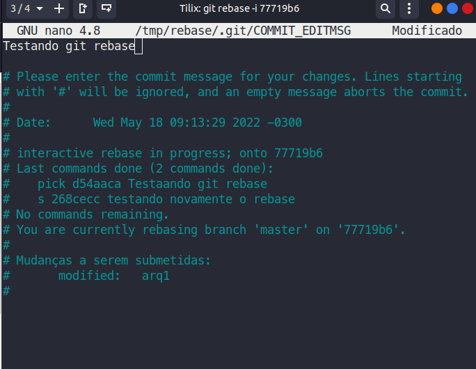

## Unir commits com git rebase -i

- logs do commit

> git log --oneline

- unir os ultimos três commites

> git rebase -i HEAD~3

- pegar id do commit anterior ao primeiro que quero unir

> git rebase -i 77719b6

